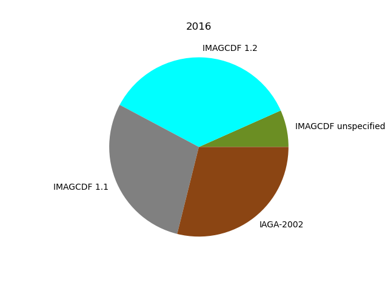
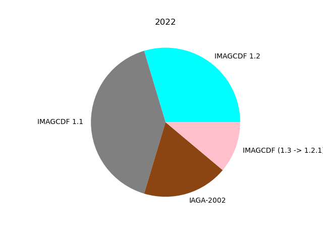
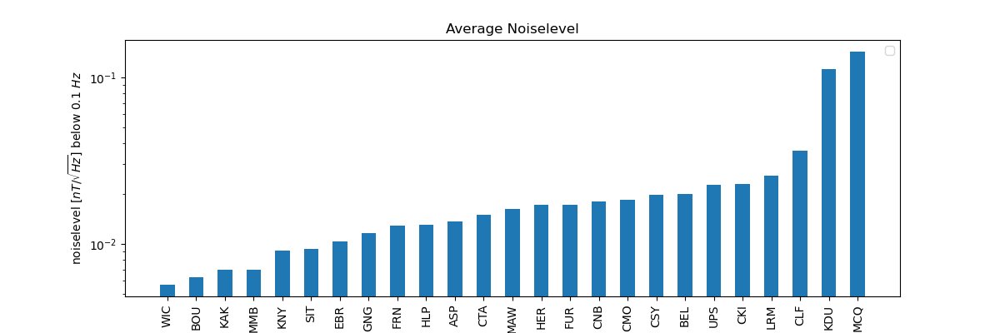

# IMBOT - an automatic data reviewing system for INTERMAGNET

### Manuscript title: Peer-review of data products: an automated assistance system for INTERMAGNET

Leonhardt, R., Heumez, B., Raita, T., Reda, J. 

Contact: R. Leonhardt, GeoSphere Austria, Conrad Observatory, Vienna


## Abstract

A peer review system is widely considered as essential to ensure the quality and accuracy of scientific research  by 
allowing experts in the field to evaluate and provide feedback on the work before it is published. Such reviews help to
identify and correct errors, inconsistencies, or gaps in methodology, analysis, or interpretation, thus improving the 
overall reliability of the research. Although a peer-review system is widely used for scientific publications, pure 
data products are typically not reviewed by the science community. INTERMAGNET, a network of geomagnetic observatories,
however, based their data publications ultimately on a international peer review system. A group of volunteering data
checkers is evaluating each data submission. Beside the obligatory 1-min data products, INTERMAGNET accepts 1Hz data
products since 10 years now. The amount of data to be checked thus has dramatically increased making it more and more
difficult to perform data checks in its classic form. The INTERMAGNET ROBOT (short IMBOT) has been developed to provide
some general initial automatic routines to convert and evaluate INTERMAGNET (IM) data submissions. The primary aims of
IMBOT are to (1) simplify one-second and one-minute data submissions for data providers, (2) to speed up the evaluation
process significantly, (3) to consider current IM archive formats and meta information (e.g. on leap seconds), (4) to
simplify and speed up the peer-review process and finally (5) to reduce the workload of human data checkers. Detailed
reports are automatically produced and send out along with templates for corrections to the submitting institute.
Notifications of human referees is also performed by IMBOT and any re-evaluation is triggered automatically when
updating data or any information in the submission directory. This automated 
system makes data review faster and more reliable, providing high-quality data for the geomagnetic community.


## 1. Introduction

A peer-review system is widely used for scientific publications, and is generally accepted as being essential for 
providíng objective results in a transparent way. Data products are typically not reviewed by
the science community. INTERMAGNET, a network of geomagnetic observatories, however, based their data publications since
2010 ultimately on a international peer review system. A group of volunteering data checkers is evaluating each data 
submission. Initially INTERMAGNET applied this peer review system to  obligatory 1-min data products, which are used
to evaluate the quality of observatory data and whether this observatory meets the strict standards of INTERMAGNET.
Since 2014 [INTERMAGNET] welcomes submissions of data products with one-second resolution. For effective archiving of 
such data sets a new data format, [IMAGCDF], has been introduced. All INTERMAGNET observatories are invited to submit 
such data sets along with their traditional one-minute data products. INTERMAGNET subjects submitted one-minute 
data sets to a peer review system in order to ensure quality and accuracy of published data.
All submitted one-minute data products are evaluated in a two-step checking process. In a first step an independent 
referee is checking the data submission trying to identify errors, inconsistencies, missing elements, missing meta information 
and evaluates the data against strict INTERMAGNET standards and thresholds. An automatic tool, check1min, is used to 
assist the referees. In a second step, a member of the INTERMAGNET operations committees definitive data group, usually the chair, is 
cross-checking reports and data, comparable to the editors decision in a publication peer-review process. If step 2 is
passed, the data will be published on INTERMAGNET's web portals. 
The hugh amount of new one-second data complicates this traditional approach. The acceptance of an observatory for 
INTERMAGNET is still solely based on the quality of definitive one-minute products. Nevertheless, submitted one-second
data should meet high INTERMAGNET standards as well and the quality of these data products needs to be tested and 
evaluated by a transparent and conclusive process. Ideally, an end user of such data products can fully access and 
understand the quality assessment scheme.
A major problem of evaluating one-second data products is the large amount of data, big file sizes, and limited software
which complicate handling for data checkers. On the data supplier side, similar problems including the need to create 
a new sophisticated data format with previously unused meta information had to be faced. These aspects are the basic 
reasons why for almost 10 years all submitted one-second data sets have not been reviewed.

In this article we briefly summarize general aspects of a data reviewing process. We will list a number of reviewing tasks
to be performed and possible issues with data submissions, specifically submission of one-second data
to INTERMAGNET, although such issues might generally affect any other data submission. We will introduce an automatic
routine to assist the peer review process by taking over a significant amount of checking tasks. The principle idea of 
IMBOT, this automatic data checker, is to minimize the work load on both sides, data supplier and 
data checker, and provide data as fast as possible to end-users.
For demonstration and testing purpose we are analyzing one-second submissions for two years, one shortly after 
introducing one-second data to INTERMAGNET (2016) and a recent submission year for which the call-of data deadline 
has been passed (2022). 


## 2. Data checking tasks

When it comes to scientific data products the review process is different in comparison to scientific
research, although there are some parallels. Generally speaking, a data product is a domain-specific, consumable 
entity aimed at transforming data into actionable insights for users (citation). In order to accomplish this task 
INTERMAGNET provides strict rules rules on data files, formats, contents, thresholds and meta information to be obeyed. 
Thus the review task can be structured in a number of important bullet points to test for these criteria. 
The role of the data reviewing is to ensure that the submitted definitive data meets INTERMAGNET standards in 
all of the following aspects and eventually to provide recommendations for improvement. Although minor correction to
meta information and file structure are possible from the referees side (as decided by IM definitive committee in 2024),
provided an approval by the data provider,
modifications on data contents are solely performed by the submitting entity. This procedure is similar to the review 
process of scientific work, where layout changes and type errors can be corrected in the editorial process, requiring 
the acceptance (proof reading) of the authors. Suggestions on scientific contents however need to be implemented by 
the authors themselfs. Thus both an automatic and human reviewing process needs to preserve data contents in its original  
state. When it come to publication through data portals of INTERMAGNET it is important to note that the data provider, 
then denoted as a INTERMAGNET observatory (IMO), retains ownership of its data. 

### 2.1. Task 1: Correct amount of obligatory files and validity of formats

The first reviewing task will always be the verification of the general contents of the submitted data product. This 
task involves the check whether the data products contains the correct amount of data files, whether naming principles
are obeyed and whether the supplied formats are correct. In terms of a INTERMAGNET one-minute data product, the
obligatory files comprise 12 binary data files with monthly coverage, 1 ascii data file containing baseline data, 1 
readme file and a file containing yearly means for the observatory. There are also non-obligatory files, at least for
the initial submission, like country information,  which can be submitted along with the data product. A one-second
submission should contain either 12 monthly or 365/366 daily data files in ImagCDF format (citation). Currently also
the submission of 365/366 daily files in IAGA-2002 format is accepted. It needs to be tested whether all requested
files are available in readable formats and whether the follow the naming conventions.

### 2.2. Task 2: Meta information complete and appropriate

Accurate meta information is the basis of all modern data acquisition. Meta data typically contains basic information 
on the acquisition location, site or station data, the sensor systems and their characteristics and data related 
parameters, like sampling rate and filter types. Meta information standards have been developed by many international
networks in order to obtain coherent data products. Thus a primary task of a reviewing process is to validate the 
provided meta information, which ís part of the individual data files and associated README's. It is further 
necessary to to check whether this meta information consistent between all different files. Required meta information
for INTERMAGNET is described in the technical manual (citation) and specific format descriptions.

### 2.3. Task 3: Data contents

When it comes to data contents it is firstly necessary to check whether each data file covers the projected time range
and and missing data set is marked with appropriate flags. It is further necessary to check whether all components are
present and whether these columns contain appropriate data. The given components as defined in the meta information
need to be present in the data file and be included according to the underlying format description. In terms of 
geomagnetic data, vectorial information can be provided in various different coordinate systems, spherical, cylindrical,
cartesian, and associated different units. The correctness of this information needs to be verified.  

### 2.4. Task 4: Data consistency

Some data products contain averages and means referring to the same underlying data set. These averages need to be
consistent within and between different files. The INTERMAGNET one-minute data product contains hourly and daily means 
within the binary data files, yearly means are contained in baseline and yearly mean files. Definitve one-second data 
for a specific observatory needs be consistent with definitive one-minute product of the same observatory, as both 
records sample the same local geomagnetic field only in different frequencies. Thus a filtered one-second product 
needs to closely resemble the one-minute data.
Beside inherent data consistency, it is also necessary to check the consistency of data products with the applied
methodology. Geomagnetic activity indices K can be calculated in various different ways (citation). If a method 
is referenced then the results need to be consistent with this methodology.
Finally, data should also be consistent with a physical framework, which means that variations need to represent a 
real, unbiased record of the geomagnetic field. A common way to verify the last condition is a comparison with well
established data from a nearby location. 

### 2.5. Data quality

The final task of a data review process concerns data quality. Overall, a unique measure of data quality is not easy to 
access in geomagnetic data as many typically used parameters like noise level, signal amplitudes are strongly dependent
on latitude, background geology, vicinity to oceans and so on. Nevertheless, the data should be free of anthropogenic
disturbances. Nearby magnetic disturbances are typically investigated by analysis of sensor differences of two
sensors, often provided as delta F between a continuous vectorial F and continuous scalar F sensor. Frequency 
disturbances can assessed by power spectral analysis. Basevalues provide a measure on stability and INTERMAGNET gives
thresholds for acceptable long term variations and accuracy below 5nT. Data continuity in baseline requires steps 
below 1 nT between successive data points. Changes in instrumentation or site characteristics might lead to 
larger "jumps" in baselines which should then be traceable and described accurately in the data's meta information. 
Data quality also comprises time step accuracy. The local geomagnetic activity indices should resemble the global
activity in a reasonable way although no thresholds are defined for this comparison. 

## 3. Basic concept of data reviewing supported by an automatic assistance system

When looking at the typical data reviewing tasks it is quiet obvious that a significant proportion can be handled
automatically. Such automatic system needs to access data submission and then run a number of testing modules
related to the tasks defined in the previous section. Ideally, an automatic process can also handle notifications and even 
referee assignment. 
The following approach, comprised by an automatic data checking python package, the InterMagnet data reviewing
roBOT (IMBOT), we relay on the following principle concept. The reviewing process is principally separated in three 
steps, which are also characterized by different data archives provided by INTERMAGNET.

### 3.1. Step 1 - submission and review

Step 1 is related to the submission process of the data provider and the also comprises any updates and or corrections 
of submitted data products. Whenever data products are submitted to INTERMAGNET they are uploaded to a
geomagnetic information nodes (GIN). The step 1 GIN is hosted by CNRS in Paris. Observatories/Institutes will 
obtain connection details after initial approval by INTERMAGNET officers. There are two different step 1 archives on the
GIN, one for one-minute data, the other for one-second data. The have a common structure, namely a yearly directory
organization and will always host solely original raw data as uploaded by the submitting entity. IMBOT is permanently
scanning these archives and an automatic analysis is triggered when ever new data is uploaded or data has been modified
whithin the step 1 directory. IMBOT version 2 is scanning the directory structure every second day starting in the night
(central european time) and will analyze data sets which have modified/created since its last scan. It will exclude data modified within the
last two hours to prevent the analysis of yet unfinished upload processes. After performing the automatic tests the
ongoing procedure is slightly different for one-minute data products and one-second data products.
For one-minute data products, the data provider as well as the assigned data checker will receive an automatic notification
including review report from the automatic process. Then the human referee is performing a review and discussing
eventual improvements with the data provider. If all questions and suggestions have finally been satisfactorily handled
the data product is ready for step 2. The data checker will upload the latest state of step 1 to the step2 archive on
the GIN. The data provider does not have access to step 2.
The one-second data treatment differs from this process for basically two reasons. Firstly, the evaluation of 
optional one-second data products requires the acceptance of the obligatory one-minute data product of the same year.
This condition is related to checking task 2.4, requiring the consistency of the two submitted data products. Thus,
the data provider will be informed and receive a preliminary automatic review report. An new automatic review will be
performed whenever data is modified/uploaded to step 1, and also if the one-minute data product reaches a new step. 
The human data checker however will only be informed as soon as the one-minute data is finally accepted for publication
(step 3). The second reason for differences, is the great variety of format type and versions plus packing tools which 
have been used to upload one-second data to step 1, as you will in the following sections. This would render a data
review very difficult as various different software products and operating system related tools are necessary to even
read such data products. Thus the automatic process is also trying to extract the data structures and reformat the
files into latest versions of INTERMAGNET recommended IMAGCDF archives covering monthly data sets. This process needs
to preserve data contents and meta information. This "homogenized" data files are automatically uploaded to step 2 and 
newly generated whenever updates on step 1 occur. The step 1 review process of one-second data is finished as soon as
the human referee is uploading a review report to step 2.

### 3.2. Step 2 - the editorial task

Step 2 can be described as the editorial task of the review process. Whenever one-minute data is uploaded to step 2 or 
final review reports are uploaded to the one-second step 2 archive, then IMBOT, also scanning step 2 directories will 
automatically inform data providers and the chairs of the INTERMAGNET definitive data committee (IM-DD) that the main review 
process is finished. The next step can be compared to a editorial task in scientific publications. The chairs of (IM-DD)
will read review reports and eventually cross check some evaluations. If coming to a positive conclusion, data will be
finally accepted and made available on step 3 which is then accessed by the definitive data portals of INTERMAGNET.   

### 3.3. Step 3 - the publication state

The upload process to step 3 is also supported by IMBOT inserting/updating the publication date of the files. Besides,
data providers are automatically informed that there data has been finally accepted and is now published.

## 4. IMBOT application

IMBOT is running on a Linux server, which currently is a POC120 industrial computer, located in southern 
Germany, hereinafter denoted as IMBOT server. The IMBOT server is maintained by an observer, the IMBOT manager, who 
monitors run time and data processing on the machine. The IMBOT server accesses periodically, e.g. every second day, the 
INTERMAGNET GIN in Paris, and donwloads any new data sets. Every other day it then scans all downloaded submission 
directories for new and modified files and directories. This process covers all repositories, namely STEP1, STEP2 and 
STEP3 directories, for one-minute and one-second data. New or modified files within the STEP1 directories are identified
by their creation and modification time, and by comparing this information with an "already processed" memory on the IMBOT
server which is updated during every scan. If a new directory or new data is found within an observatories directory at 
the GIN, which has not changed for at least 2 hours, then data within is directory will be analyzed.
Reading and writing processes are relying on the MagPy2.0 (citation) library, which supports all data formats currently
used in the geomagnetic community and is able to support future modifications. 
IMBOT consists of three separate applications: The first application, IMBOT_convert, will download data products from 
the GIN and eventually adopt the directory structure, which is necessary to step 3 one-minute, so that the step 3
directory structure is similar to step 1 and step 2, simplifying further processing. The second application, IMBOT_scan,
will scan step 1 folders of one-minute and one-second products, and compare file creation/modification times to a local
memory, namely a json style files containing details on current states of all subdirectories. The third application,
IMBOT_analysis, will analyse modified data sets according to the tasks defined in section 2.

### 4.1. IMBOT one-minute

For one-minute analysis, step1 minute data is synchronized with the IMBOT server. New or modified data sets will be 
identified by comparing directory contents with a local memory based on the last check. If new or updated data sets are 
found, then an initial read test on all data file will be performed based on the [MagPy] package. If successful, all 
data sets will be supplied to [CKECK1MIN] (citation) running in a [wine] emulation environment on the IMBOT server. CHECK1MIN,
a MS-DOS routine, performs fundamental checks on file formats, metadata consistency, reported means, and discrepancies between files. 
Actually, submitting IMOs are requested to perform this data check already before submitting data and add such reports 
to their submission. Running a MS-DOS routine however get more and more complicated for data suppliers as such routine 
is not inherently supported by any modern operating system. Thus an automatic application simplifies the future usage 
until INTERMAGNET is updating format requirements for one-minute data. 
The CHECK1MIN process includes checks for end-of-line characters in text files and
header information in the obligatory INTERMAGNET archive format (IAF) files, by verification of words W01-W16 in those 
binary files. It tests annual mean consistency, comparing yearmean.imo with values calculated from 1-minute data in
IAF files. Discrepancies are flagged only if they exceed the file's resolution (1 nT & 0.1 minute). Baseline metadata
is checked in the imoyyyy.blv file and observatory metadata in the readme.imo file. While there is no INTERMAGNET 
specification for this file, its metadata should remain consistent with other files. Daily and hourly mean consistency
in IAF files is tested, ensuring differences do not exceed 0.2 nT. The format of the yearmean.imo file is verified.
Please note, CHECK1MIN does not detect incorrect field formats, such as "2019 500" or "2019.500" in yearmean.imo. No 
errors should be reported in any of the above checks. If CHECK1MIN flags the annual mean from IAF 1-minute values as
999999.0, it indicates insufficient data for a complete mean calculation (<90% of values available).


### 4.2. IMBOT one-second

For one-second analysis, the new data set will automatically be downloaded and eventually extracted (supported are zip, gz and
tar) to a temporary directory on the IMBOT server. All data sets will
be read and subsequently the evaluation steps as outlined below will be performed. Finally, data will be exported into
monthly [IMAGCDF] archive files as requested by INTERMAGNET and uploaded to step 2 on the GIN. The full evaluation process is
summarized within an individual [IMBOT 1s report] for each observatory. The report, eventually including recommendations
on updates/fixes, will then be send to the submitting institute. Please note: e-mail addresses are taken from a local
e-mail repository or, if not existing there, are extracted from the one-minute readme.imo submission. The
report is written in markdown language, which can be viewed in formatted ways on freely available programs (e.g. [dillinger.io]), on
[GitHub] and also opened in any text editor. If the data set already satisfies all conditions for final evaluation, 
then a data checker will be assigned and the [IMBOT 1s report] will also be send directly to the data checker, provided
an excepted step 3 one-minute submission is available. All 
automatic processes are logged and reports on newly evaluated data and eventual problems are send to the IMBOT manager.
Converted data files, reports, and if necessary, a template for meta information updates, will also be uploaded to
the step 2 directory for one-second data in the GIN. Original submission in step1 are kept in their original state. 
It is currently discussed whether step 2 information is deleted after final acceptance and movement of data products
to step 3.

#### 4.2.1 Quality levels of the automatic analysis

The automatic evaluation routine of IMBOT one-second makes use of a level description of which level 2 is the highest
possible grade. Data suppliers will get an automatic feedback whenever a new evaluation of their data is triggered by
IMBOT, indicting a current level of the automatic checking routine.

##### Level 0

Indicates significant problems with the data structure, related to large gaps, unreadable files or non-interpretable
file structure. Institutes receiving a level 0 report are asked to contact the IMBOT manager for support.

##### Level 1

Any uploaded data set which is complete and fully readable, and can be converted to an [IMAGCDF] format is
automatically assigned to level 1. The uploaded data sets can be either [IAGA-2002] files or [IMAGCDF] files.
Compressed archives containing 
these files using ZIP, GNUZIP and/or TAR are also supported. If the data set does not qualify for level 2, a file
called **level1_underreview** will be created which provides information on the evaluation state of the data set.
**underreview** indicates, that the data set can reach the next evaluation level if appropriate information is
provided or data checking is finished. Reports will be send out to data suppliers. The most common issue preventing 
a level 2 classification is missing meta information. The submitting institute is asked to read the report carefully 
and solve the listed issues in order to reach level 2.

##### Level 2

Level 2 acceptance requires that all requested meta information is provided, including information on standard levels
as outlined in the [IMAGCDF] format description, like timing accuracy, instruments noise levels etc. Besides, a level 2
check includes some basic test on data content (completeness, time stamping etc) and includes a basic comparison with 
submitted/accepted one-minute data products to evaluate the definitive character. If successful, a [IMBOT 1s report] is
constructed (e.g. **level2_underreview.md**). Again data suppliers will receive a complete report. As soon as the
underlying one-minute data product from the supplier is finally accepted, the one second data product is reevaluated
and a data checker for final evaluation is assigned. All Level-tests are performed completely automatically by IMBOT.


#### 4.2.2 Updating missing information

After submitting your data, IMBOT will check your data for general readability and completeness. It will create a
[IMBOT 1s report] which will be send to the submitting institute.
Within this report you will see, what level has been assigned to your submission. In dependency of this level, you
eventually need to take action:  

##### Data is assigned to level 0

Your data could not be read or significant problems with your submission were encountered (e.g. no one second data, 
empty or corrupt files). Please correct the issues and upload a new data set. If you do not know how to proceed, 
contact the IMBOT manager.

##### Data is assigned to level 1

Some meta information or data is missing. Please check the issue list in the level report you received. If data is
missing, please upload such data files. If meta information is missing, please use "meta\_IMO.txt" file also
attached to your reporting e-mail. Please add any missing meta information into this file as outlined and described 
within this text file (an example is given in the appendix). Finally upload this meta\_IMO.txt file to the step1 upload 
directory. DO NOT CHANGE THE FILENAME. Uploading this file or any new data file will trigger an automatic re-evaluation.

It is possible to supply a meta\_IMO.txt file directly with original submission. If you submit [IAGA-2002] files 
some required information for creating INTERMAGNET CDF archives is always missing. By supplying this data directly with
the submission, you can directly reach level 2 grades without any further updates.


#### 4.2.3 Summary of all aspects checked by IMBOT one-second

Regarding task 2.1, submitted files and formats, it is tested whether all requested files are available in readable
formats (IAGA-2002, IMAGCDF). It is further tested whether the correct amount of files ia available and then 
all submitted data is converted to 12 monthly IMAGCDF files with IM recommended filenames, which homogenizes the 
variability of data submissions, particularly early data. 

The meta information (task 2.2) is verified. It is tested whether all files contain the requested meta information 
and whether this meta information is consistent between all different files. Required meta information is described 
in the [IMAGCDF] format descriptions. If meta information is missing, a summary will be given in the [IMBOT 1s report] 
and a template will be created to support the submitting institute in providing this information without a complete
upload of the large data set. Besides, the report will contain some information on non-obligatory meta information
which might, however, be helpful for end users. The conversion process will change one input of the original meta 
information, namely the format type which will be updated to the most recent INTERMAGNET recommended format.

Data contents of task 2.3 firstly involves the checking data coverage in all files by IMBOT. If individual data points
are missing (time step and/or values), the report will contain amount and month of occurrence. Sometimes, the last 
second in monthly data sets is missing as shown below, particularly in December submission. If more then just 
individual points are missing, the data set might be classified as level 0, as such missing-data-observation might be caused by 
corrupted uploads and downloads. The submitting institute, however, can confirm the unavailability of such data easily by
using the meta\_IMO.txt template. If F values are provided, IMBOT tests whether these values are independent measures 
of the field (S), as requested by INTERMAGNET. This test is done by calculating delta F and its standard deviation from
the vectorial components on a monthly basis. If both values are negligible small, non-independency is assumed. 
Temperature columns are also read and monthly mean temperatures are listed in the report, for a quick validity check.

Regarding task 2.4 the consistency with submitted one-minute data products is tested. As both data product are termed
"definitive" samples of the timely evolution of the geomagnetic field from a single location, this is of particular
importance. The difference analysis is performed by filtering the one-second data product to one-minute, using 
the IAGA/INTERMAGNET recommended gaussian filter (citation). Then filt-one-minute is compared to the already 
accepted one-minute data product. The standard deviation of the difference and individual maximal amplitude 
differences are tested and listed in the report. If amplitude differences are very small i.e. below 0.1 nT, this
excellent agreement indicates that obviously one-second data is the primary analyzed signal of the submitting institute, and all "cleaning"
has been performed on this data set. Minute data is just a filtered product of the one-second data set. If larger
amplitudes are observed, then either independent cleaning has been performed, an
non-gaussian filter has been used, baseline treatment differs, or different instruments are the basis of both data sets.
If differences between average
monthly values of each component exceeding 0.3 nT are found then the assigned level is reduced from 2 to 1. It should 
be stated here that non of the tested data submissions exceeded this threshold so far. When it comes to individual
amplitude differences - TODO mention thresholds -  
IMBOT is not performing tests whether data is consistent with the
underlying analysis methods as this is not easily possible for one second submissions. Consistency with expectations 
by comparing with nearby sites has usually already been performed for the already accepted one-minute product.
 
A data quality assessment, as summarized in task 2.5, is performed but is not used as a criteria for level
classification. IMBOT runs tests and provides a summary of its results within the report, so that the submitting
institute as well as the data checker gets some initial feedback about quality parameters. 
Delta F variations are calculated on a monthly basis, in case such data is provided along with the data set. Average
delta F, which is expected to be close to zero, and its standard deviation are listed in the report. From every month,
three randomly selected days are extracted, altogether 36 days every year, and are used to calculate an average daily 
power spectral density function. Using periods below 10 seconds, the average noise level is determined. This average 
noise level and its standard deviation are provided in
the report. As noise level is part of the requested StandardLevel description of the IMAGCDF's meta information, you
will get some recommendation for IMOS-11 (see [IMAGCDF]). If the standard deviation of the noise level is relatively
high (e.g. approaching or exceeding mean value) the submitting institute might want to check for technical and other
disturbances. What currently is not tested for are individual outliers. 


## 5. Results for automatic analyses of step 1 data


The analysis of one-minute data is straightforward and the automatic routine is basically only a notification system. 
The CHECK1MIN routine is well tested and the overall automatic testing and notification procedure does not contain any
significant obstacles. Therefore we will focus on the much more
heterogenic and much more voluminous one-second data products, which are also the main reason for developing such
automatic assistance system. For the following in-depth analysis we select submissions from two years and will summarize 
the current state from April 2025. Please note that this state is not reproducible as IMO's will review their data 
products and modify their step 1 submissions in order to get their data sets accepted in the near future. This 
particularly affects 2022 data sets which are currently handled by INTERMAGNET data checkers and will gradually be
extended to earlier submissions. This manuscript is based on the submission status of 23. March 2025. 

### 5.1. One-second data submissions and status of automatic analysis

Table 5.1 summarizes the current submission status of one second data since the official start in 2014. Such an 
overview is of particular interest for data managers and although this just represents a current status at the time
when submitting this article, such information can be easily extracted anytime when needed from IMBOT using its 
management interaction tools as shown in the appendix. A peak in submission ($N_{sub}$) was reached for 2018 with data 
sets from 53 INTERMAGNET observatories, indicating that about half of the 
IMOs are ready to provide such high frequency products. Shown are also the amount of successful automatic analyses in 
step2 ($N_{aut}$). An automatic analysis is termed successful if level2 is reached. Only in this case, provided that 
corresponding one-minute data has been accepted, human referees are informed and continue the evaluation process. 
Automatic IMBOT analyses are currently active for 2019 onwards, although earlier years have 
been partly analyzed for testing purposes. The amount of data sets which have been checked by human data checkers and
(in all cases) have been finally accepted for publication is shown in column $N_{ac}$. Please note that the manual 
data checking procedure has started only recently, explaining the relative low number of currently accepted data products.
In order to save storage space on GINs it is also planned to remove accepted step2 
one-second products after this data sets are published on the INTERMAGNET portal, as the underlying data will be 
identical. Thus, only the originally submitted raw data product and the homogenized published archive are preserved, 
including review protocols of IMBOT and the human data checker.

| year | $N_{sub}$ | $N_{aut}$ | $N_{ac}$ |
|------|-----------|-----------|----------|
| 2014 | 41        | -         | -        |
| 2015 | 44        | -         | -        |
| 2016 | 45        | -         | -        |
| 2017 | 45        | -         | -        |
| 2018 | 53        | -         | -        |
| 2019 | 50        | 40        | 4        |
| 2020 | 43        | 35        | 8        |
| 2021 | 32        | 28        | 4        |
| 2022 | 29        | 25*       | 2        |
| 2023 | 20        | 11*       | 0        |
| 2024 | 0         | 0         | -        |  

*Should be 28 for 2022 (but i.e. FUR leads to memory failure in old IMBOT) and likely also higher for 2023 (check).
Old versions reports level1 for BOU (dF/G), SIT (df/G) and HER and aborts analysis for FUR


### 5.2. In-depth analysis of submitted data sets 

Any automatic analysis system requires accurate monitoring and statistical analysis tools particular when it comes to
critical pre-selections of data products, whether they are suitable for a final review or not. This is of essential 
interest not only for the data publisher, but also for the data supplier who usually denotes a significant amount
of work to get their data products ready for publication. In order to outline how IMBOT is approaching these two 
challenges we will firstly have a detailed look on INTERMAGNET data submissions. For this report we will focus on 
submissions from two years, 2016 and 2022. 

One-second data products from 45 observatories have been submitted for 2016. These data files have been upload to 
the step 1 folder of the Paris GIN in various different ways and formats. A summary of the underlying formats is shown 
in Figure 5.1. Submissions make use of either the IAGA-2002 
format (citation) or different versions of IMAGCDF (citation). IAGA-2002 submissions cover
daily records which then have been packed into either daily, monthly or yearly zip files using zip or tgz
compressions tools. In three cases complex non-standard compression routines were used. IMAGCDF file submissions consist 
mostly of daily files, compressed in gnuzip or zips or just 
combined into tar archives. Monthly IMAGCDF files without any additional compression as requested in 2016 by
INTERMAGNET are provided by a few observatories only.  

Figure 5.1a: 

Since 2016 INTERMAGNET and several observatories provided new tools for IMAGCDF export and also the official CDF 
tools improved. When looking at the submission status for 2022, the proportion of correct submissions using a 
modern version of the IMAGCDF format increased strongly. The heterogeneity in packing and compression algorithms
significantly decreased. Three observatories submitted data sets with flagging information, denoted with a preliminary,
in-official version number 1.3, which will hereinafter denoted as version 1.2.1. For three observatories, a step 3
one minute data product is not available (ABK, DED, HRN). Therefore, these data sets are missing in the analyses of 
5.3 onwards. 

Figure 5.1b: 

The automatic analysis routine IMBOT is able to extract data from all compression and archiving formats used so far 
in data submission. It further can handle all different file formats and their underlying versions and data coverages.
Thus the automatic system is able to overcome problems of data suppliers to fulfill stringent format requirements, which 
is of significant help for some institutions.  Adept quickly to such requirements requires manpower and 
IT support which is not equally available in observatories. 

### 5.3. Supporting the data supplier 

After downloading and extracting all data submissions, data is subject to the checking procedure as outlined in section 4.
When looking at the automatic level assignment and compare submissions for 2016 and 2022 one can easily spot that the 
relative amount of level 2 grades significantly increased between those years. The main reason of level 1 grades
is missing meta information, particularly the required information on Standard Level classification 
of field [PartialStandDesc](https://tech-man.intermagnet.org/stable/appendices/dataformats.html#imagcdfv1-2-intermagnet-exchange-format).
For the 2022 submissions, IMBOT send meta-information templates to the data suppliers in case if such missing meta
information which are used by all those observatories. The data supplier does not need to recreate all data sets,
they just need to upload the required meta-information in a simple text file which will then be considered by
IMBOT and included into the converted step 2 editorial data products. As can be seen in Figure 5.2 the relative proportion
of level 2 data sets is much higher for 2022 than for 2016. This is partly related to the usage of the meta templates
and to another part to better controlled submissions. For 2022 only three level 1 data products and no level 0 product 
oppose 26 level 2 data sets. For 2016 there were 21 level 1 and two level 0 data sets together with 18 level 2 data sets.
The main reason for level 0, only observed in old 2016 submissions are missing data or individual unreadable, likely 
corrupted data files.

Figure 5.2: 

The main reason of level 1 products in 2016 is missing meta information, and missing data due insufficient file 
coverage is the second most important. For 2022 only the second reason remains, as the data supplier improved their own
data production strategy and for several submissions use the meta template provided by IMBOT. 
The main reason for two level 1 data products in 2022 is related to significant disturbances of delta F values, the 
difference between a continuous scalar F and the vector F, observed for a single month (Figure 5.3).

Figure 5.3:  will trigger a level reduction")

The example of Figure 5.3 indicates likely a problem of baseline adoption for two days. As the data supplier obtains 
details on the failure and its specific month, they can quickly react and correct the issue.  
In all level 1 and level 0 cases the automatic report contains instructions for the data supplier on how to obtain a 
level 2 data product. In most cases this requires meta information, re-uploading of individual files or 
confirmation/correction of missing data. The report will contain the respective month, so that the data supplier can 
quickly identify the source of the error report.
When updating the corresponding files und uploading the corrected data sets, IMBOT will be triggered and the data 
product will be reanalyzed. Therefore the data supplier will get an immediate feedback on his data submission 
and can react to eventually arising problems within hours to days, thus significantly speeding up the publication 
process. All issues to be resolved for achieving a level 2 product are listed on top of the IMBOT report in section
"Issues to be clarified for level2", denoting the observed issue and the month in which it was observed.

### 5.4. Supporting the data checker and final judgement

As soon as the data submission is reaching level 2 of the automatic checking system and corresponding one-minute data
has been accepted, then a data checker is assigned and informed. The data checker will receive the same report as the 
data supplier. Although an automatic level 2 test indicates a high quality data set, most checks have been performed 
on monthly averages. Furthermore, complex data quality issues are not tested by IMBOT. The data checker can
access the editorial step 2 files and thus does not have to bother with compression and format issues. All INTERMAGNET
software products recommended for data checkers can handle editorial step2 contents. In addition, the IMBOT report 
eventually contains section 4: "To be considered for final evaluation". The automatic 
report will also contain some hints and information useful for the data checker, as well as for the data supplier,
providing some insights in data quality and consistency. Beside details on comparisons between minute and second data,
some general information is provided about delta F (G), if available, and a measure of the noise level. The noise
level is one of the few testable standard descriptions.
A median noise level of the submission is determined by selecting 3 records with minimal average $K_{FMI}$ each month.
These 36 records correspond to 10% of the collection and are then used to estimate the average noise level. The power 
spectral density (PSD) of the selected daily records is calculated and the individual noise level of each selected day 
is obtained as the mean of the amplitude spectrum between nyquist and a period of 10 seconds. All daily noise levels
are collected and extreme outliers are removed by testing the median of distances from the median, corresponding to a 
2-sigma selection in case of a normal distribution . 
This value provides some control on IMOS-11, part of the obligatory meta information in PartialStandDesc. 
Such median noise level strongly depends on environmental conditions and the instruments in use by the observatory
and a inter-comparison with other observatories might also provide some insight on possible improvements for data 
providers. For most IMOs providing one-second data, the noise level is usually relatively low, 
even below 20pT/$\sqrt{Hz}$ for half of the data suppliers for 2016. For 2022 the majority 
of submissions are characterized by noise levels below 20pT/$\sqrt{Hz}$ (Figure 5.4). For two data sets noise levels exceeding 
100pT/$\sqrt{Hz}$ are found of which one has the correct corresponding IMOS-11 input. 

Figure 5.4: 

The noise level and a comparison to other observatories might be helpful when planing instrument and installation 
upgrades. Nevertheless, data suppliers and data checkers might test the power spectral density function for identifying 
technical and other noise contributions in lower frequencies, which eventually can point to spurious signal contributions 
from other instruments or electronic devices.

### 5.5. Homogenizing data products for publications

Every successful analysis of step1 data, obtaining an IMBOT level 1 or level 2 is converted into a step 2 data product. 
These step 2 archive files follow the naming and content convention of the newest IMAGCDF version, 1.3. at the time of 
writing this article. The conversion routine also incorporates manually provided meta information from the meta 
templates. This procedure ascertains that the final publication products are standardized and also simplifies data 
access for data checkers, as basically all format relevant issues have been solved this way. Conversion, however does 
not alter or modify the submitted data in any way. In Figure 5.5 we are showing an example of a step1 data set (top),
the same day extracted from step 2 (middle) and the difference of both (bottom), demonstrating that data is exactly the same considering 
the full resolution of the original data set. 

Figure 5.5: ")

Step 2 files will also contain any auxiliary data set like temperature or scalar data in the original resolution. The 
step 1 meta information will be preserved completely, adding any additional information provided with a meta data 
template. The filename, name of time column assignments, and format types of numerical inputs (strings will be 
transformed to floats) might be be changed to meet the IMAGCDF 1.3 standard. Obviously also the format type will be
updated to 1.3 for step2 products.

## 6. Discussion and Conclusion

Automatic systems for quality control are of particular interest when is comes to evaluation of hugh data sets.
Geomagnetic data is particular challenging due to its non-stationary character and the highly dynamic, non-periodic 
signal contributions affecting a wide range of different frequencies and signal origins. Careful control by the data 
providers and removal or marking of spurious signals is of great interest for the end user. INTERMAGNET distinguishes
"definitive" data, subjected to an intense checking procedure and "real time" data, so called adjusted or variation 
products useful for early warning systems and space weather applications.
INTERMAGNET not only asks their data suppliers to perform such data quality control, but also subjects such data sets to 
a peer review system, which unquestionably increases trustworthiness for end-users. A big drawback of such testing and 
review procedure is the delay with which such data will be available to end-users. A second problem is the amount of work 
for the referees/data checkers who usually are volunteers and perform these tasks beside their usual work. 
As shown above an automatic system like IMBOT will help to speed up the evaluation process, particularly for a stock pile
of yet untreated old submissions. 
For any future submission it should help the data provider by giving prompt and exact information about eventual 
improvements. Data providers are immediately informed about the current status and progress of the review process until
final publication of their data product.

IMBOT is ready for a number future challenges. Thus is can treat data including flagging information. Flagging
information however is updated to be conform with newest IMAGCDF and flagging software (MagPy2.0) standards. IMBOT 
one-minute is already capable of reading and analyzing other one-minute data formats i.e. like a yearly IMAGCDF 
one-minute data file (IMO_2016_PT1M.cdf). At the current stage only basic read tests, ascerting a correct data format
and its general readability are performed. This one-minute test module can however be extended for more intense 
data checking similar to check1min.
Although IMBOT has been created for definitive one-second data it can also be modified and used for other data sets 
as well. A possible application would be high resolution variation data which could be quickly checked with such 
routine and provided as a tested data product by INTERMAGNET basically on the fly. Further data sources might also be
included. 
IMBOT is written completely modular. Each checking technique is described and coded in an individual module. Thus, 
IMBOT can be simply extended or modified towards others tests and other data sets.


Currently it is an ongoing discussion which criteria and thresholds are necessary in order to evaluate submitted data
sets. IMBOT makes use of a minimal approach. The highest automatic grade requires that the data sets are readable, 
complete and (correctly) contain all requested information for the [IMAGCDF] file format. Data quality is tested but 
no criteria for failure. 

TODO: what criteria are currently in use, how to distinguish between excellent and good

Any final judgement of data quality or more sophisticated analysis of its definitive character is currently subject of a final
analysis by a human data checker. As the data sets are automatically converted to
a common data format, further data access is straight forward. A detailed level report allows to judge the
classification also for end users and eventually select data which suit their needs. Due to the detailed standard level
description of the [IMAGCDF] format, a level 2 product already contains essential details on data quality as provided
by the data submitter. Part of this information is cross checked by IMBOT (e.g. noise level). Based on this information
it is suggested here that a level2 data set is complete, conclusive and usable for end users. From a modelers
perspective, this information is sufficient to work with the data products.

IMBOT can be used instantly for all future processing of new one second uploads. It can also be used to start an 
evaluation of all submitted data sets from 2014 onwards and provides the possibility to get this data sets published 
on INTERMAGNET within hours. For testing the capabilities of IMBOT and for reviewing of its methods, it is possible
to run IMBOT for selected observatories and to send reports and mails only to a selected group of referees. It is our
intention to describe IMBOT and all methods as good as possible. The source code is accessible and, thus, the 
evaluation process is transparent both for submitters and end users.


   [INTERMAGNET]: <https://intermagnet.github.io/>
   [IMAGCDF]: <https://www.intermagnet.org/publications/im_tn_8_ImagCDF.pdf>
   [MagPy]: <https://github.com/geomagpy/magpy>
   [dillinger.io]: <https://dillinger.io/>
   [7z]: <https://www.7-zip.org/>
   [GitHub]: <https://github.com/>
   [IAGA]: <http://www.iagftp.seismo.nrcan.gc.caa-aiga.org/>
   [IAGA-2002]: <https://www.ngdc.noaa.gov/IAGA/vdat/IAGA2002/iaga2002format.html>
   [IAF]: <https://www.intermagnet.org/data-donnee/formats/iaf-eng.php>
   [IMBOT 1s report]: <https://github.com/INTERMAGNET/IMBOT/blob/master/examples/level1_underreview.md>
   [check1min]: <http://magneto.igf.edu.pl/soft/check1min/>
   [wine]: <https://www.winehq.org/>
   [NRCAN]: <ftp.seismo.nrcan.gc.ca>


Acknowledgments:

Sergey Komoutov

## To be added

- Report example with some explanations
- meta file with instructions
- threholds

## Appendix 1: Installation instructions

IMBOT is a python project specifically developed and tested in debian like Linux environments. The recommended setup
was tested on Ubuntu 22.04 but will work in future versions provided the underlying packages are still available.
Before installing and using imbot as described in this manuscript you need to install the following additional
packages:

       sudo apt-get install wget curlftpfs p7zip-full p7zip-rar wine python3-virtualenv

These packages are used to access data sources, unpack compressed data and make use of the well established 
check1min routine for one-minute data checking. Then create a separate python environment for imbot.

       virtualenv ~/env/imbot 

Active the new environment:

       source ~/env/imbot/bin/activate

Install MagPy which provides the libraries for file recognition and some analysis tools

       pip install geomagpy

Finally install imbot. The installation process will also create a .imbot directory in your home folder containing a
number of templates and skeletons for configuration files.

       pip install imbot

Continue with imbot configuration in appendix 2.


## Appendix 2: Defining Referee and Observatory mailing lists

Referee mailing lists should be named as follows: refereelist_second.cfg and refereelist_minute.cfg. The refereelist
files contain e-mails and associated observatory lists of currently active data checkers. It is also possible
to provide 'special assignments', which are data checkers responsible for data submissions from a number of given 
observatories in a specific year. These special assignments will override the general data checker list. The 
refereelist file needs to be updated periodically. If you want to keep a backup copy of old refereelist files it is 
necessary to change rename the file extension from "cfg" to "bak". 

Mailing addresses for IMOs are obtained in the following order:

1. conf/mailinglist.cfg
2. memory/memory_email.json (addresses extracted earlier from READMEs)
3. mail addresses extracted from the one-minute submissions (readme file)

Mailing addresses extracted from the one-minute submissions are also stored locally in a json file called 
memory/memory_emails.json. This is important as step3 one-minute data has no readme files any more.  

Fallback addresses, i.e. data checker if observatory has not yet been assigned to a specific data checker, the 
address of the system administrator and imbots mailingaddress are part of the general configuration file.

## Appendix 3: imbot2.0 general workflow

Scheduled jobs in the following order:

1. download/sync data sources to local harddrive
   - scheduled jon of download_min and download_sec which are both making use of wget
   - step1, step2 minute; step1 second are copied to the harddisk
   - step3 minute plus conversion
   - step2 second requires an rsync process as new data is uploaded and referee reports are downloaded
   - TODO monitor these jobs
2. imbot_scan.py is called to update local memory based on download folders
   - creates a local memory file with all step and analysis information for all data sets
   - require a backup of the memory (weekly) - using MARTAS
   - monitor using MARTAS
3. analysis.py is called to extract modified data from memory and run min/sec analysis
   - run the jobs and create mails
   - send mails to receivers
   - TODO create reports and send via messenger and mail
   - monitor successful completion of analysis

## Appendix 4: setting up an IMBOT server from scratch

### Installing packages based on Ubunutu >= 20.04

- install magpy>=2.0 (follow the magpy installation instructions, used for read/write)
- get MARTAS and install a dummy martas job, telegram (used for monitoring and backup)
- sudo apt-get install curlftpfs (mounting external devices)
- sudo apt install p7zip-full p7zip-rar (unpacking second data)
- sudo apt install wine (for check1min dos program)
- install imbot 

       pip install imbot...

### Empty/New system and ONLY there

Run initialization script to create configuration scripts and templates 

### Configuring all packages

#### configuring wine for check1min analysis

Copy check1min.exe to your homedirectory. Then do an initial test run with wine

       $ wine start check1min.exe

The above command will create a .wine folder in your home directory. After ending the the
test run mv the check1min program to /home/USER/.wine/drive_c/

       $ mv check1min.exe /home/USER/.wine/drive_c/

Create a data directory under drive_c:

       $ cd /home/USER/.wine/drive_c/
       $ mkdir data

Update imbot.cfg. Modify the inputs for "winepath" with /home/USER/.wine/drive_c/.

#### configuring imbot

go to ~/.imbot and copy the following files to the main directory if not there
1) download_min.sh: edit to download one-minute data from GIN
2) download_min.sh: edit to download one-second data from GIN
3) ginsource.sh: edit for GIN credentials
4) scan.sh: edit to run scan and analysis job

modify/edit the following files:
1) conf/imbot.cfg
2) conf/refereelist_minute.cfg
3) conf/refereelist_second.cfg
4) conf/mailinglist.cfg


#### configuring MARTAS applications

1) monitor: monitor disk space and scan file logs
2) backup: add ~/.imbot to the backup routine
3) activate cleanup to clear temporary directory without restart

##  Appendix 5: example for a meta_OBSCODE.txt

```sh
## Parameter sheet for additional/missing metainformation
## ------------------------------------------------------
## Text to explain how to fill it
## Use "None" if not available

# Provide a valid standard level (full, partial), None is not accepted
StandardLevel  :  partial

# If Standard Level is partial, provide a list of standards met
PartialStandDesc  :  IMOS11,IMOS14,IMOS41

# Reference to your institution (e.g. webaddress)
ReferenceLinks  :  www.my.observatory.org

# Provide Data Terms (e.g. creative common lisence)
TermsOfUse  :  Do whatever you want with my data

# Missing data treatment (if data is not available please uncomment)
#MissingData  :  ignore
```

## Appendix 6: useful bash commands on te linux IMBOT server (outdated)

Count the amount of subdirectories in a specific folder (i.e. get number of submissions):

          find * -maxdepth 0 -type d | wc -l

Get an overview about all level reports in all subdirectories:

          find . -print | grep -i level

Get all human referee reports:

          find . -print | grep -i accept

Delete old cdf form names

          find . -name "*_000000_PT1S_4.cdf" -exec rm -f {} \;


In any case 
the human data checker will investigate the data product and provide a final review report, also to be uploaded 
to the editorial step 2 directory on the GIN. In case of "acceptance" by the human data checker, the data product 
is published by INTERMAGNET.

Table 1 provides a short summary on this pre-analysis condition.

The download process of IMBOT is able to extract all of these different packing structures and the underlying
MagPy library is able to read all the different file formats. Thus an automatic analysis is possible for all those 
products. 

Below a table summarizes IMBOT analyses of 2016. The 2016 analysis has also been used for development and error
analysis of the underlying packages. IMBOT makes use of [MagPy] and requires version 0.9.7 or larger particularly for
the one-minute data comparison, as some reading issues with [IAF] data have been solved in this version. All reports
and converted files are readily available, but have not yet been send out to the submitting institute. As IMBOT firstly
requires a conceptual acceptance from [INTERMAGNET] and reviews of its methodology, all these results are preliminary
and do not indicate any decision from [INTERMAGNET].

CTA, WIC, EBR (Jan OK, Feb leads to abort) failed for 2016. Check why
CTA and EBR have missing data or corrupted files, check meta_ ... missing data

Parameter             | 2016 |   2022
--------------------- |------| ------
Available submissions | 45   | 29
Submitted as IAGA-2002 | 13   | 13
Submitted as ImagCDFvs1.0 | 23   | 23
Submitted as ImagCDFvs1.1 | 23   | 23
Submitted as ImagCDFvs1.2 | 23   | 23
Submitted as ImagCDFvs1.3 | 23   | 23
Auxiliary meta information | 0    | 36
IMBOT successful analyses | 36   | 36
Accepted for step3 | 0    | 2
 vs1.1
Level 0 | 3 | 3
Level 1 | 25 | 25
Level 2 | 8 | 8
Most common level0 reason | empty file for one month
Most common level1 reason | StandardLevel description missing (in all level 1 cases)


Go through the analysis in detail - discuss all tasks:

Meta info

Predominantly level 1 classifications are found. The basic reason for this classification, found in all level 1 data
sets, is the absence of a StandardLevel description as requested in [IMAGCDF]. This information is missing for all
IAGA-2002 submissions. StandardLevel description supports two inputs: **full** or **partial**. In case of **partial**,
details on the standard levels are required. A full list is provided in the [IMBOT 1s report]. In order to deal with
this issue, the observatory just needs to fill out the provided template, which is sent out with the report. After
uploading the meta template to the submission directory the data set is re-evaluated. This way, most of the level 1
submissions will get re-evaluated for level 2 with minimal workload and data transfer. The second most important reason
for level one is usually an incomplete December record with one second missing on 31 December. Uploading this data file
with a complete amount of seconds will also trigger a re-evaluation.


Contents and coverage

When looking at the file coverage it is found that about 20% of the submissions do not cover the expected time range.
These files usually contain one second of the previous month and end at 23:59:58 of the last day in the month. When
it comes to expected meta information, requested information is missing in more than 75% of all submissions.
Nevertheless, most of these issues are not difficult to solve, although they would require a significant amount of
discussion between data checker and submitting institute.


The most common reason for level 0 is a missing record for one month although an empty data file is provided. The most
likely cause for this observation is a corrupted file structure. Details are provided in the [IMBOT 1s report].
Uploading the data file again and checking its size will most likely solve this issue. In one case, indications for
many duplicates are found within the file structure for a few months.
Overall, all submissions have been carefully prepared and submitted data generally is of high quality.


Table with all results for appendix

OBSCODE | Level |  sub. DataFormat | IMBOT vers |   Level 0 problem   |    Level 1 problem   |   Other issue
------- | ----- | ---------------- | ---------- | ------------------- | -------------------- | ------------------
ABK     |   2   |   IMAGCDF 1.2    |    0.9.1   |                     |                      |
ASP     |   1   |   IMAGCDF 1.1    |    0.9.1   |                     |  StdLev, Amount12    |
BDV     |   0   |   IMAGCDF 1.1    |    0.9.1   |   Duplicates        |                      |
BEL     |   1   |   IMAGCDF 1.1    |    0.9.1   |                     |  StdLev, Amount12    |
BOU     |   1   |   IAGA-2002      |    0.9.1   |                     |  StdLev              |
BRW     |   1   |   IAGA-2002      |    0.9.1   |                     |  StdLev              |
BSL     |   1   |   IAGA-2002      |    0.9.1   |                     |  StdLev              |
CKI     |   2   |   IMAGCDF 1.1    |    0.9.1   |                     |                      |
CMO     |   1   |   IAGA-2002      |    0.9.1   |                     |  StdLev              |
CNB     |   1   |   IMAGCDF 1.1    |    0.9.1   |                     |  StdLev              |
CSY     |   1   |   IMAGCDF 1.1    |    0.9.1   |                     |  StdLev              |
CTA     |   0   |   IMAGCDF 1.1    |    0.9.1   |  Month missing      |                      |
DED     |   1   |   IAGA-2002      |    0.9.1   |                     |  StdLev              |
EBR     |   0   |   IMAGCDF 1.1    |    0.9.1   |  Month missing      |                      |
FRD     |   1   |   IAGA-2002      |    0.9.1   |                     |  StdLev              |
FRN     |   1   |   IAGA-2002      |    0.9.1   |                     |  StdLev              |  7z, very high noise level?
GNG     |   1   |   IMAGCDF 1.1    |    0.9.1   |                     |  StdLev, Amount12    |
HER     |   1   |   IMAGCDF 1.1    |    0.9.1   |                     |  StdLev              |
HLP     |   1   |   IMAGCDF 1.1    |    0.9.1   |                     |  StdLev, Amount12    |
HON     |   1   |   IAGA-2002      |    0.9.1   |                     |  StdLev              |  7z
HRN     |   1   |   IMAGCDF 1.1    |    0.9.1   |                     |  StdLev, Amount12    |
KAK     |   2   |   IMAGCDF 1.x    |    0.9.1   |                     |                      |  min with 0.9.7
KDU     |   1   |   IMAGCDF 1.1    |    0.9.1   |                     |  StdLev, Amount12    |
KNY     |   1   |   IMAGCDF 1.x    |    0.9.1   |                     |  Amount6,7           |  memory issue (firefox?)
LRM     |   1   |   IMAGCDF 1.1    |    0.9.1   |                     |  StdLev              |
LYC     |   2   |   IMAGCDF 1.2    |    0.9.1   |                     |                      |
MAW     |   1   |   IMAGCDF 1.1    |    0.9.1   |                     |  StdLev, Amount12    |
MCQ     |   2   |   IMAGCDF 1.1    |    0.9.1   |                     |                      |
MMB     |   2   |   IMAGCDF 1.x    |    0.9.1   |                     |                      |  min with 0.9.7
NEW     |   1   |   IAGA-2002      |    0.9.1   |                     |  StdLev              |  7z
SHU     |   1   |   IAGA-2002      |    0.9.1   |                     |  StdLev              |
SIT     |   1   |   IAGA-2002      |    0.9.1   |                     |  StdLev              |      
SJG     |   1   |   IAGA-2002      |    0.9.1   |                     |  StdLev              |      
TUC     |   1   |   IAGA-2002      |    0.9.1   |                     |  StdLev              |      
UPS     |   2   |   IMAGCDF 1.2    |    0.9.1   |                     |                      |      
WIC     |   2   |   IMAGCDF 1.2    |    0.9.1   |                     |                      |

